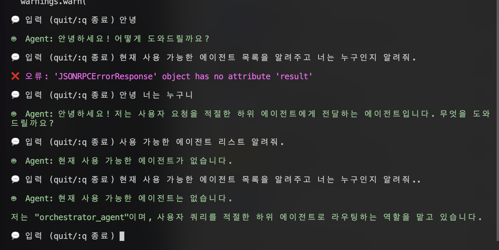

# 🧠 Easy A2A Sample Code

A2A(Agent-to-Agent) 기반 프로젝트입니다.
이 프로젝트는 Host Agent가 Remote Agent들과 협업하여 사용자 요청을 처리하는 구조를 가지고 있으며, CLI를 통해 테스트할 수 있습니다.
간단하게 작성된 Host Agent와 Remote Agent를 커스터마이징하여 응용하고 활용할 수 있습니다.

---

## 프로젝트 디렉토리 구조

```bash
/a2a_official
├── agent_registry.json             # 에이전트 정보 등록 JSON (예시: 아래 참고)
├── agents                          # 에이전트 관련 코드
│   ├── __init__.py
│   ├── current_time_agent          # 시간 정보를 제공하는 Remote Agent
│   │   ├── __init__.py
│   │   ├── agent.py                # 에이전트 정의
│   │   ├── main.py                 # 실행 진입점
│   │   └── server.py               # API 서버
│   ├── host                        # Host Agent 관련 코드
│   │   ├── __init__.py
│   │   ├── agent_connect.py        # A2A 프로토콜을 통한 원격 에이전트 연결 관리
│   │   ├── entry.py                # 서버 진입점, CLI 및 HTTP 서버
│   │   ├── memory.py               # 대화 기록과 에이전트 실행 결과 영속화
│   │   └── orchestrator.py         # LLM 기반 작업 라우팅 및 에이전트 오케스트레이션
│   └── korea_agent                 # 한국 관련 응답을 처리하는 Remote Agent
│   │   ├── __init__.py
│   │   ├── agent.py
│   │   ├── main.py
│   │   └── server.py
│   └── agent_template              # Remote Agent Template
│       ├── __init__.py             # 패키지 초기화 파일
│       ├── agent.py                # 에이전트 핵심 로직 (AI 처리)
│       ├── main.py                 # 실행 진입점 (CLI)
│       └── server.py               # A2A 서버 구현
├── cli
│   └── cli.py                      # CLI를 통한 테스트 실행
├── readme_image
│   └── cli.png                     # CLI 실행 예시 이미지
├── README.md
└── utilities
    └── custom_logger.py            # 로깅 유틸
```

---

## 작동 구조 간략 다이어그램

```
[User] --(CLI)--> [Host Agent] --(A2A Protocol)--> [Remote Agent(s)]
```

---

## 환경 설정 및 실행 가이드

### 1. `.env` 파일 설정

`.env_example` 파일을 `.env`로 복사한 후, 다음 API 키를 입력하세요.

```bash
GOOGLE_API_KEY=
OPENAI_API_KEY=
OLLAMA_API_BASE=http://localhost:11434
```

### 2. 가상환경 설정

```bash
python3 -m venv .a2a
```

### 3. 가상환경 활성화

```bash
source .a2a/bin/activate
```

### 4. 에이전트 실행

#### Remote Agent #1 (Korea Agent)

```bash
source .a2a/bin/activate
python -m agents.korea_agent.main --host localhost --port 10000
```

A2A 로그만 보고 싶을 때:

```bash
python -m agents.korea_agent.main --host localhost --port 10000 --log-level A2A
```

#### Remote Agent #2 (Current Time Agent)

```bash
source .a2a/bin/activate
python -m agents.current_time_agent.main --host localhost --port 10001
```

A2A 로그만 보고 싶을 때:

```bash
python -m agents.current_time_agent.main --host localhost --port 10001 --log-level A2A
```

#### Host Agent

```bash
source .a2a/bin/activate
python -m agents.host.entry --host localhost --port 10003
```

A2A 로그만 보고 싶을 때:

```bash
python -m agents.host.entry --host localhost --port 10003 --log-level A2A
```

### 5. CLI 환경 테스트

```bash
cd cli
python cli.py --agent http://localhost:10003 --user test --chat 001
```

* 테스트 결과

  * 

---

## agent\_registry.json 예시

```json
[
    "http://localhost:10000",
    "http://localhost:10001"
]
```

---

# 커스터마이징 가이드

* Remote Agent를 확장/추가하려면 `agents/` 디렉토리에 새 폴더를 만들고 `agent.py`, `server.py`, `main.py` 파일을 같은 구조로 작성하세요.
* 반드시 `agent_registry.json`에 새 에이전트 정보를 추가해야 `Host Agent`가 인식합니다.

---

## Remote Agent 확장 방법 (Step by Step)

### 1단계: 파일 복사

* `agents/agent_template` 폴더를 복사하여 새 Remote Agent 폴더를 생성합니다.

### 2단계: 기본 정보 수정

1. `main.py`의 host와 port 번호 설정

```python
@click.option("--host", default='localhost', help="Host to bind the server to") # 호스트 변경
@click.option("--port", default=10001, help="Port number for the server")  # 포트 변경 (겹치지 않게)
```

2. `server.py`의 agent card 정보 수정

```python
def _create_agent_card(self) -> AgentCard:
    skill = AgentSkill(
        id="your_agent_id",                    # 에이전트 고유 ID
        name="YourAgentName",                  # 에이전트 이름
        description="에이전트 설명을 입력하세요",    # 에이전트 설명
        tags=["tag1", "tag2"],                 # 에이전트 태그
        examples=["예시 질문 1", "예시 질문 2"]   # 예시 질문들
    )
    
    return AgentCard(
        name="YourAgentName",                  # 에이전트 이름 (위와 동일)
        description="에이전트 설명을 입력하세요",    # 에이전트 설명 (위와 동일)
        # ... 나머지는 그대로 유지
    )
```

3. `server.py` 클래스명 변경 (선택사항)

```python
class YourAgentExecutor(AgentExecutor):     # TemplateAgentExecutor → YourAgentExecutor
class YourA2AServer:                       # TemplateA2AServer → YourA2AServer
```

### 3단계: 에이전트 로직 구현

* `agent.py`에서 실제 AI 처리 로직을 구현합니다.

```python
class YourAgent:  # TemplateAgent → YourAgent
    
    def __init__(self):
        """에이전트 초기화"""
        # LLM 클라이언트 초기화
        # 예: self.llm_client = OpenAI(api_key="your-key")
        pass
    
    def _build_agent(self):
        """에이전트 빌드"""
        # AutoGen, LangChain 등 프레임워크 사용시 에이전트 빌드
        pass
    
    async def process_message(self, message_text: str) -> str:
        """메시지 처리 - 핵심 로직"""
        # 실제 AI 처리 로직 구현
        # 예시:
        # response = await self.llm_client.chat.completions.create(...)
        # return response.choices[0].message.content
        
        return f"YourAgent 응답: {message_text}"
```

### 4단계: 테스트 실행

* 에이전트 서버 실행

```bash
python -m agents.your_agent_name.main --port 10001
```

---

## 문의 및 피드백
* 개선 요청, 버그 제보 등은 [이슈 등록](https://github.com/your-repo/issues) 또는 PR 환영합니다!
* 그런데, 제가 github 이슈 등록 관리 부분을 잘 몰라서... 메일로 주시면 빠르게 답변 및 회신 드리겠습니다. (email : tutmr999@naver.com)
